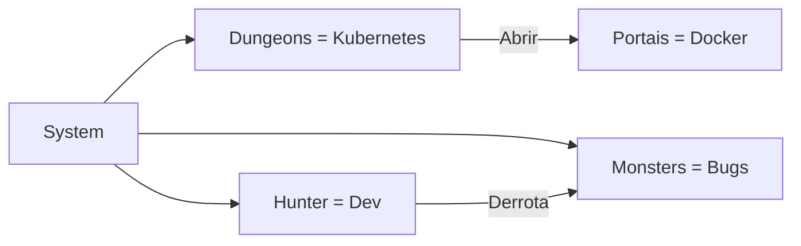

<!-- Cabeçalho Épico com GIF Animado -->

  
  <h1>⚡ Matheus Silva (Wuotans) ⚡</h1>
  
<em>"Aqueles que continuam avançando... alcançarão a resposta!" - Sung Jin-Woo</em>

<!-- Barra de Status com Animações -->

  
  
  
  

---

## 🧙‍♂️ Arsenal do Monarca das Sombras

### 🔮 Linguagens

  
  
  
  

### ⚔️ Frameworks

  
  
  
  
  
  

### 🏰 Bancos de Dados

  
  
  

### 🛠️ Ferramentas

  
  
  
  
  
  

### 🖥️ Servidores

  
  
  

---

## 🏆 Sistema de Dungeon (Projetos)

### 🔥 [Portfólio Matheus-Silva](https://github.com/wuotans/Matheus-Silva)

> **Portal do Monarca**  
> React + Next.js + Docker  
> *"A presença de um S-rank é sentida!"*

📜 Descrição da Missão

Portfólio pessoal com sistema de CI/CD integrado e design responsivo. Demonstra habilidades e conquistas como caçador S-rank.

---

### 💰 [MoneyFlow](https://github.com/wuotans/MoneyFlow)

> **Tesouro do Dragão**  
> Python + Pandas + Airflow + PostgreSQL  
> *"O fluxo de mana precisa ser controlado!"*

📜 Descrição da Missão

Sistema de gestão financeira com análise preditiva e relatórios automatizados. Monitora fluxos monetários como um dragão guardião.

 

---

### 🏬 [Gabriele Papelaria](https://github.com/wuotans/gabriele-papelaria-sistema)

> **Castelo Mercantil**  
> Django + React + MySQL  
> *"Um reino precisa de administração eficiente!"*

📜 Descrição da Missão

ERP completo para papelaria com módulos de estoque, vendas e RH. Domine seu negócio como um verdadeiro monarca.

---

### 📧 [EmailMasterPT](https://github.com/wuotans/emailmasterpt)

> **Mensageiro das Sombras**  
> JavaScript + Node.js + MongoDB  
> *"Comunicações instantâneas através das dimensões!"*

📜 Descrição da Missão

Sistema de automação de emails com templates dinâmicos e analytics. Suas mensagens chegam mais rápido que um portal dimensional.

 

---

### 🔌 [DBConnector](https://github.com/wuotans/dbconnector)

> **Chave Dimensional**  
> Python + SQLAlchemy + Prometheus  
> *"Conecte-se a qualquer reino de dados!"*

📜 Descrição da Missão

Biblioteca universal para conexão com múltiplos bancos de dados com suporte a failover e pooling. Sua chave mestra para o multiverso dos dados.

---

### 🖨️ [Sistema Papelaria](https://github.com/wuotans/gabriele-papelaria)

> **Arsenal Mercantil**  
> Django + PostgreSQL + Docker  
> *"Equipamentos de qualidade para toda jornada!"*

📜 Descrição da Missão

Sistema de gestão para papelaria com controle de inventário e vendas. Mantenha seu arsenal sempre abastecido.

 

---

## 📊 Estatísticas de Batalha

  
  

---

## 🌌 Domínios de Conhecimento

## 📬 Contato do Caçador

  
  

  
  
<em>"Um dia, vou ser o caçador mais forte!" - Sung Jin-Woo</em>

🌐 English Version

### 🔥 Highlighted Projects
- [Matheus-Silva Portfolio](https://github.com/wuotans/Matheus-Silva)
- [MoneyFlow Financial System](https://github.com/wuotans/MoneyFlow)
- [Gabriele Papelaria ERP](https://github.com/wuotans/gabriele-papelaria-sistema)
- [EmailMasterPT Automation](https://github.com/wuotans/emailmasterpt)
- [Universal DBConnector](https://github.com/wuotans/dbconnector)
- [Stationery Management System](https://github.com/wuotans/gabriele-papelaria)

